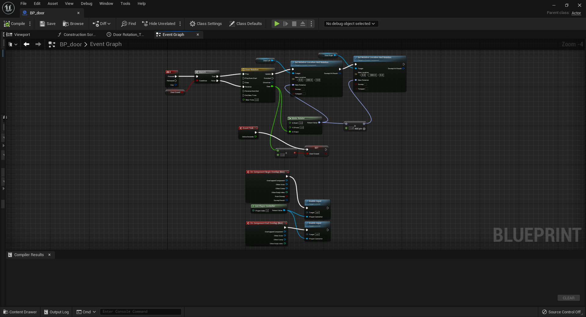

# Unreal Refrence

## Introduction
For the past two weeks I have been working on an Unreal live project with the tech acadmey.
We were given a simple sandbox to start with with some very basic assets and a basic level to start with, and we were given no rules on what to make.
I decided on a third person shooter for my project, a fairly simple game where you played a wizard trying to get a magic scroll to win.

## Story 1: Landscape and Structures
In this story, no coding was needed. It was just to make a level for the player to play in. I chose to learn the landscape and foliage tools as well as I could.
I created a basic landscape and got some building and plant props from a free asset pack on the marketplace. I used the foliage painter to place all of the grass and trees.
I also took a stab at making a terran material that I could use to blend various textures together. Namely a grass and gravel texture. This was the hardest part of this story, but I managed to figure it out.

A wide shot of the landscape.

A close up shot

## Story 2: GameMode and HUD
In this story, I set up the player spawn and controller, as well as got a HUD working. The HUD was pretty simple, with a health bar and a mana bar. This was also the first story where I had a player character to run around with.

In game shot

This was also my first forray into coding for Unreal. Here is what the HUD graph looks like.

## Story 3: Collectables/Obstacles
In this story I set up various collectables for the player. Since I planned for the enemies to be the obstacle for this game, but those were covered in a later story I just added some logic for a gate that blocks the player.
For collectables, I had a health and mana potion as well as the scroll that would win the game. I made the mana potion first and based all the rest on it.

Mana potion graph

Gate graph

## Story 4: Menus
In this story I created various menu's for the game. This proved to be much easier than previous engines I've used. A simple widget and a blank level was all I needed to add a main menu, how to play, game over, and victory screens.

The graph for the main menu. All the other screens had simular functions, though this one is the most complicated.

## Story 5: Complete Gameplay
This story saw me finish out the last elements of gameplay. I added the victory collectable and added two spells for the player character. A firebolt and a push spell. The firebolt was pretty simple, but the push was much harder.
A major issue that came up in the next story with the push spell was when an enemy was moving, it wouldn't work. I eventually figured out it was due to the enemy AI moving against the push, requreing the enemy to be stopped for the push.

Firebolt graph

Push spell graph

## Story 6: Enemy AI
In this story, I worked on making the enemies functional. First, this involved getting a character made. I got an asset pack off the market place with some skeletal meshes and animations for them to use for my enemies.
Putting together the acutall viewport model wasn't super hard. Just added the skeletal mesh and made a quick and dirty 1D animation blend for a walk/run animation. I also created a quick animontage for an attack.
Instead of using a more complex behavior tree, I stuck with just using the BP system, as I didn't need the enemies to be complicated. They just needed to follow the player when spotted and attack when they got close.

Enemy graph

## Story 7: Add SFX
This story was very simple and stright forward. Looking on the previous graphs, it can be seen that I added several sound effects, some from a free pack on the market place and some from the starter kit.
I also added some background music via a music cue.

## Skills Learned
- How to work by myself. The instuctors were avilable if I got really stuck, but most of the time I had to look things up myself. The terrain painting and foliage painter were both examples of things I had to learn myself.
- How to make a game in Unreal from start to finish using the BP system.
- How the SCRUM mehtod of project management works.
- The many features of Unreal. I had used Unity before, and it was the engine I was most familar with. Having seen the tools and power of Unreal 5, I have to say that I've found a new favorite.
